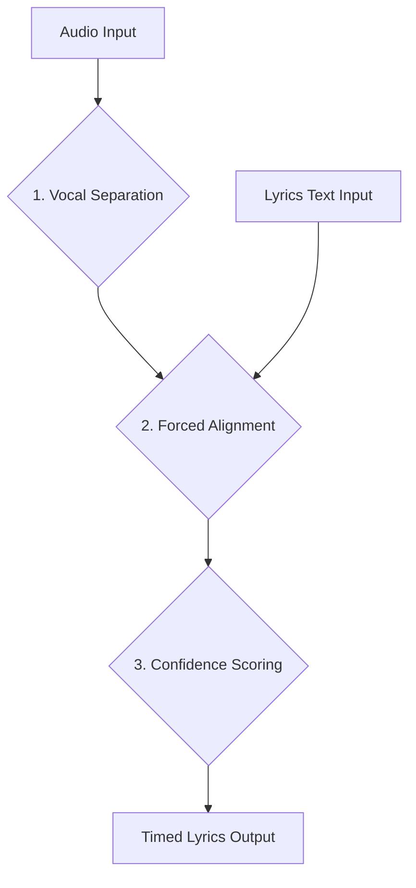

# Beatloom Lyric Synchronization: Proposed Technical Architecture

## 1. High-Level Architecture Overview

The proposed architecture is a modular, multi-stage pipeline designed for accuracy, flexibility, and extensibility. It replaces the current monolithic and unreliable lyric synchronization system with a series of specialized components, each performing a distinct task. This design is based on best practices identified in the research phase, including the critical importance of vocal separation and the use of singing-specific alignment models.

### Architectural Goals

*   **Accuracy**: Achieve word-level synchronization with high precision for a wide variety of musical genres.
*   **Robustness**: Gracefully handle songs with complex arrangements, background noise, and varying vocal styles.
*   **Modularity**: Allow for individual components to be updated or replaced as new technologies emerge.
*   **Extensibility**: Provide a framework for adding new features, such as real-time alignment or user feedback mechanisms.
*   **Traceability**: Enable detailed logging and confidence scoring at each stage of the pipeline for easier debugging and quality assessment.

### Proposed Pipeline

The new synchronization pipeline will consist of the following stages:



1.  **Vocal Separation**: The raw audio input is first processed to isolate the singing voice from the instrumental accompaniment. This is a crucial step that significantly improves the accuracy of the subsequent alignment stage.
2.  **Forced Alignment**: The isolated vocal track and the corresponding lyric text are fed into a singing-oriented forced aligner. This component will generate precise time stamps for each word or phoneme.
3.  **Confidence Scoring**: The output of the alignment stage is evaluated to determine the confidence level of the synchronization. This allows for the identification of potentially inaccurate alignments that may require manual review.
4.  **Timed Lyrics Output**: The final output is a structured data format containing the lyrics and their corresponding time stamps, which can be seamlessly integrated into the Beatloom visualization engine.

This modular approach allows for a clear separation of concerns and facilitates a more robust and maintainable system. Each stage can be developed, tested, and optimized independently, leading to a more reliable and accurate lyric synchronization solution.


## 2. Component Deep Dive: Vocal Separation

The first and most critical stage of the new architecture is vocal separation. The goal of this stage is to isolate the singing voice from the instrumental accompaniment, providing a clean vocal track for the subsequent alignment process. The research phase has shown that this is a non-negotiable step for achieving high-accuracy lyric synchronization, a fact underscored by the success of commercial solutions like AudioShake, which leverage advanced vocal isolation technology [1].

### Recommended Tool: Demucs

For this stage, we recommend using **Demucs**, a state-of-the-art music source separation model developed by Facebook Research [2]. Demucs has demonstrated superior performance in separating vocals, drums, bass, and other instruments from a mixed audio track. It is open-source, well-documented, and has a vibrant community, making it an ideal choice for integration into the Beatloom system.

### Rationale for Choosing Demucs

*   **State-of-the-Art Performance**: Demucs is widely recognized as one of the best open-source models for music source separation. It consistently ranks high in the Music Demixing Challenge (MDX) and is used as a benchmark in many research papers.
*   **Hybrid Model**: The latest version of Demucs utilizes a hybrid spectrogram and waveform-based model, which allows it to capture both fine-grained details in the waveform and the broader harmonic structure in the spectrogram. This results in cleaner and more natural-sounding vocal separations.
*   **Pre-trained Models**: Demucs provides pre-trained models that have been trained on a massive dataset of music, allowing for immediate use without the need for a costly and time-consuming training process.
*   **Ease of Integration**: Demucs can be easily integrated into a Python-based workflow. It provides a simple command-line interface as well as a Python API, offering flexibility for the integration with Beatloom.

### Implementation Details

The vocal separation stage will be implemented as a preprocessing step in the Beatloom pipeline. The `demucs` Python library will be used to perform the separation. The following is a conceptual code snippet illustrating how Demucs can be used within the Beatloom system:

```python
from demucs.separate import separate_sources

def isolate_vocals(audio_path):
    """
    Separates the vocal track from an audio file using Demucs.

    Args:
        audio_path (str): The path to the input audio file.

    Returns:
        str: The path to the isolated vocal track.
    """
    # The separate_sources function returns a dictionary of separated tracks.
    # We are interested in the 'vocals' track.
    separated_sources = separate_sources(audio_path)
    vocal_track = separated_sources['vocals']

    # Save the vocal track to a temporary file for the next stage.
    vocal_track_path = "/tmp/vocals.wav"
    sf.write(vocal_track_path, vocal_track.T, samplerate=44100)

    return vocal_track_path
```

By integrating Demucs as the first stage of the pipeline, we can significantly improve the quality of the audio signal fed into the forced aligner, thereby dramatically increasing the accuracy of the final lyric synchronization.

### References

[1] AudioShake. (2023, October 5). *New lyric transcription & alignment*. AudioShake. https://www.audioshake.ai/post/introducing-lyricsync-for-lyric-transcription-alignment

[2] Facebook Research. (n.d.). *facebookresearch/demucs: Code for the paper Hybrid Spectrogram and Waveform Source Separation*. GitHub. https://github.com/facebookresearch/demucs


## 3. Component Deep Dive: Forced Alignment

With a clean vocal track isolated by Demucs, the next stage is to perform the forced alignment. This is where the magic of synchronization happens. The goal of this stage is to take the isolated vocal audio and the raw lyric text as input, and output a precise, time-stamped transcription. Based on our extensive research, we recommend using **SOFA (Singing-Oriented Forced Aligner)** for this critical task [3].

### Recommended Tool: SOFA (Singing-Oriented Forced Aligner)

SOFA is an open-source forced alignment tool specifically designed for singing voice. This makes it a vastly superior choice compared to generic speech-oriented aligners like the Montreal Forced Aligner (MFA), which, as its own documentation states, is not intended for singing [4]. SOFA is built to handle the unique acoustic properties of the singing voice, such as vibrato, melisma, and pitch variations, which are the very characteristics that cause traditional ASR systems to fail.

### Rationale for Choosing SOFA

*   **Singing-Specific Design**: Unlike MFA or WhisperX, SOFA is purpose-built for music. It uses acoustic models that have been trained on singing data, enabling it to accurately align lyrics to sung vocals.
*   **Phoneme-Level Accuracy**: SOFA operates at the phoneme level, providing a high degree of precision in the timing of each word. This is essential for creating a professional-quality karaoke-style experience.
*   **Open-Source and Actively Developed**: SOFA is an open-source project with an active community. This means that it is continuously being improved and that we can contribute to its development if needed.
*   **Integration Flexibility**: SOFA can be used as a command-line tool or integrated into a Python script, providing the flexibility needed for the Beatloom system.

### Implementation Details

The forced alignment stage will take the vocal track from the previous stage and the lyric text file as input. The `sofa-align` command-line tool will be used to perform the alignment. The output will be a TextGrid file, which is a standard format for storing time-aligned transcriptions. This file can then be parsed to extract the word-level timings.

A conceptual workflow would be:

1.  **Prepare Inputs**: The isolated vocal track (e.g., `/tmp/vocals.wav`) and the lyric text file (e.g., `lyrics.txt`) are prepared.
2.  **Run SOFA**: The `sofa-align` command is executed with the appropriate parameters.
3.  **Parse Output**: The resulting TextGrid file is parsed to extract the start and end times for each word.

Here is a conceptual Python snippet demonstrating how to use SOFA:

```python
import subprocess
import textgrid

def align_lyrics_with_sofa(vocal_track_path, lyrics_path):
    """
    Aligns lyrics to a vocal track using SOFA.

    Args:
        vocal_track_path (str): The path to the isolated vocal track.
        lyrics_path (str): The path to the lyric text file.

    Returns:
        list: A list of (word, start_time, end_time) tuples.
    """
    output_textgrid_path = "/tmp/aligned_lyrics.TextGrid"

    # Run the SOFA command-line tool.
    subprocess.run([
        "sofa-align",
        "-a", vocal_track_path,
        "-t", lyrics_path,
        "-o", output_textgrid_path
    ])

    # Parse the output TextGrid file.
    tg = textgrid.TextGrid.fromFile(output_textgrid_path)
    word_tier = tg.getFirst("words")
    
    aligned_lyrics = []
    for interval in word_tier:
        word = interval.mark
        start_time = interval.minTime
        end_time = interval.maxTime
        aligned_lyrics.append((word, start_time, end_time))

    return aligned_lyrics
```

By using a singing-specific tool like SOFA, we can overcome the fundamental limitations of the current Beatloom system and achieve a level of accuracy that was previously unattainable.

### References

[3] Qiu, Q. (n.d.). *qiuqiao/SOFA - Singing-Oriented Forced Aligner*. GitHub. https://github.com/qiuqiao/SOFA

[4] Montreal Forced Aligner. (n.d.). *Troubleshooting*. Read the Docs. https://montreal-forced-aligner.readthedocs.io/en/v3.2.3/user_guide/troubleshooting.html


## 4. Component Deep Dive: Confidence Scoring

After the forced alignment stage, it is crucial to have a mechanism to evaluate the quality of the synchronization. This is where the **Confidence Scoring** component comes in. The purpose of this stage is to assign a confidence score to the alignment, indicating how likely it is to be accurate. This is a feature that is completely lacking in the current Beatloom system, and its addition will provide a significant improvement in terms of reliability and user experience.

### Rationale for Confidence Scoring

*   **Quality Assurance**: Not all alignments will be perfect. A confidence score allows us to programmatically identify and flag low-quality alignments that may require manual review or correction.
*   **Fallback Mechanism**: When the confidence score is below a certain threshold, we can trigger a fallback mechanism, such as using a different alignment model or notifying the user that the synchronization may be inaccurate.
*   **User Feedback Loop**: Confidence scores can be used to guide a user feedback system. For example, we can prompt the user to review alignments with low confidence scores, and their corrections can be used to improve the system over time.
*   **Data for Future Improvements**: By logging the confidence scores and the corresponding audio and text data, we can build a dataset for training and evaluating future alignment models.

### Implementation Strategy

Confidence scoring can be implemented using a combination of heuristics and machine learning models. The SOFA tool itself may provide some form of confidence score, but we can also develop our own metrics based on the characteristics of the alignment.

Here are some potential features to consider for a confidence scoring model:

*   **Acoustic Model Score**: The likelihood of the audio signal given the aligned phonemes, as computed by the forced aligner.
*   **Duration of Words**: Unusually short or long word durations can indicate an alignment error.
*   **Number of Unaligned Words**: If a significant number of words in the lyrics could not be aligned, this is a strong indicator of a problem.
*   **Pitch and Energy Contours**: The alignment of words should correlate with the pitch and energy contours of the vocal track. A lack of correlation can indicate an error.

### Conceptual Implementation

A simple confidence scoring model could be a weighted sum of these features. A more sophisticated approach would be to train a machine learning model, such as a logistic regression or a small neural network, to predict the probability of a correct alignment based on these features. This would require a dataset of alignments that have been manually labeled as correct or incorrect.

Here is a conceptual Python snippet illustrating how a simple confidence score could be calculated:

```python
def calculate_confidence_score(aligned_lyrics, vocal_track_path):
    """
    Calculates a confidence score for a given alignment.

    Args:
        aligned_lyrics (list): A list of (word, start_time, end_time) tuples.
        vocal_track_path (str): The path to the isolated vocal track.

    Returns:
        float: A confidence score between 0 and 1.
    """
    # This is a simplified example. A real implementation would be more complex.
    num_words = len(aligned_lyrics)
    num_unaligned_words = 0  # This would need to be determined from the aligner's output.
    
    # Heuristic 1: Penalize for unaligned words.
    unaligned_penalty = num_unaligned_words / num_words

    # Heuristic 2: Analyze word durations.
    word_durations = [end - start for _, start, end in aligned_lyrics]
    avg_duration = sum(word_durations) / num_words
    # ... more sophisticated duration analysis ...

    # Combine heuristics into a final score.
    confidence = max(0, 1 - unaligned_penalty) # ... and other factors

    return confidence
```

By implementing a robust confidence scoring mechanism, we can build a more reliable and trustworthy lyric synchronization system. This will not only improve the user experience but also provide a solid foundation for future improvements and extensions.


